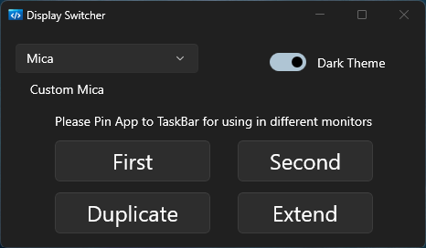

# Display Switcher

This project is a display switcher that allows you to easily switch between different displays connected to your computer.

## Screenshots

## Platform

- Windows 10 19041 or later
- .NET 8.0
- WinUI 3.0 SDK

## Features

- Switch between displays with a single click
- Support First/Second/Duplicate/Extend display modes
- Support multiple backdrop mode: Mica/Acrylic
- Jumplist selection for quick switching
- [WIP] Supports multiple displays
- [WIP] Windows background service
- [Tray Icon](https://github.com/HavenDV/H.NotifyIcon/?tab=readme-ov-file#winui-context-menu)

## Installation

1. Clone the repository: `git clone https://github.com/zhenyuan0502/DisplaySwitcher.git`
2. Build and run it on Visual Studio 2022

## Usage

Simple usage :)

## Contributing

Contributions are welcome! If you have any ideas, suggestions, or bug reports, please open an issue or submit a pull request.

## License

This project is licensed under the MIT License. See the [LICENSE](LICENSE) file for more information.
